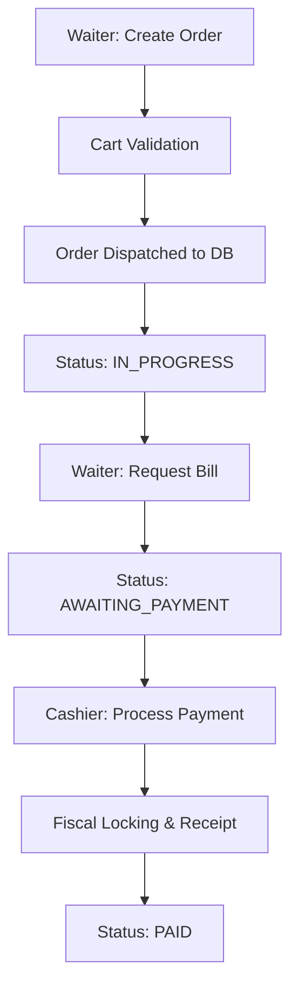

# Chez Keke POS — Development Plan & Status

A full-featured Point-of-Sale web application for a restaurant, built with Next.js (App Router). Three distinct user roles drive the experience: **Admin**, **Waiter**, and **Cashier**.

> [!IMPORTANT]
> **BACKEND STATUS: INTEGRATED & LIVE**
> The system has successfully transitioned from mock data to a live **Neon PostgreSQL** database. All core transaction flows (Order Dispatch → Payment Processing → Fiscal Locking) are now operational on the production backbone.

---

## 📸 Core Dashboards

````carousel

<!-- slide -->

````

---

## 👥 User Roles & Access

| Role | Access Level | Responsibilities | Redirect Path |
|------|-------------|------------------|---------------|
| **Admin** | Full Control | Menu, Users, Global Settings, Reports | `/admin/dashboard` |
| **Waiter** | Terminal | Order taking, Kitchen dispatch, Bill requests | `/pos` |
| **Cashier** | Desk | Payments, Fiscal receipts, Daily settlements | `/cashier` |

---

## 🧭 Integrated Features

### 🔴 Admin Flow [85% Complete]
- [x] **Live Sales Stats**: Real-time revenue tracking, gross vs net yield, and tax collection analytics.
- [x] **User Management**: Create, edit, and deactivate staff accounts with secure password hashing.
- [x] **Global Settings**: Toggle Tax (VAT/NHIL/GETFund) on or off system-wide.
- [x] **Audit Logs**: Internal tracking of security and administrative changes.
- [/] **Menu CRUD**: (UI built, API pending final categorization logic).

### 🟡 Waiter Flow [100% Complete]
- [x] **Live Menu Sync**: Fetches real-time categories and available items from the DB.
- [x] **Order Dispatch**: Collision-proof order number generation (`ORD-XXXXXX`).
- [x] **Staff Attribution**: Every order is tracked back to the authenticated waiter.
- [x] **Digital Cart**: Automated subtotal calculation before kitchen dispatch.

### 🟢 Cashier Flow [100% Complete]
- [x] **Live Ticket Feed**: Auto-refreshes every 8 seconds (polling) to show new bills.
- [x] **Fiscal Locking**: Snapshots tax rates at time of sale to ensure historical data accuracy.
- [x] **Transaction Integrity**: Payment recording and order status updates happen in an atomic DB transaction.
- [x] **Dynamic Receipts**: Receipt system automatically handles item name wrapping and respects global tax settings.

---

## 🗂️ Order Lifecycle


---

## 🏗️ Technical Backbone

| Layer | Technology | Status |
|-------|------------|--------|
| **Frontend** | React 18 / Next.js (App Router) | Active |
| **Styling** | Vanilla CSS + Tailwind | Active |
| **Database** | Neon PostgreSQL | Connected |
| **ORM** | Prisma | Configured |
| **Auth** | NextAuth (JWT) | Secure |
| **State** | Zustand | Synchronized |

---

## 📌 Implementation Roadmap

| Step | Page / Component | Progress | Status |
|------|-----------------|----------|--------|
| 1 | DB Schema & Auth Bridge | 100% | [x] LIVE |
| 2 | Waiter Terminal Dispatch | 100% | [x] LIVE |
| 3 | Cashier Desk & Payments | 100% | [x] LIVE |
| 4 | Fiscal Receipt Engine | 100% | [x] LIVE |
| 5 | Admin Settings & Tax Toggle | 100% | [x] LIVE |
| 6 | User Access Control (CRUD) | 100% | [x] LIVE |
| 7 | Dashboard Analytics (Stats) | 100% | [x] LIVE |
| 8 | Menu & Category Management | 40% | [/] STAGED |
| 9 | Multi-Table Management | 30% | [/] STAGED |
| 10 | End-to-End Stress Testing | 0% | [ ] PENDING |

---

## 🛠️ Maintenance & Debugging
- **Logs**: Backend logs use `console.error` for API failures.
- **Polling**: Cashier feed is currently set to an **8,000ms** interval.
- **Fiscal**: All tax percentages are stored as decimals (e.g., 0.15 for 15%).
